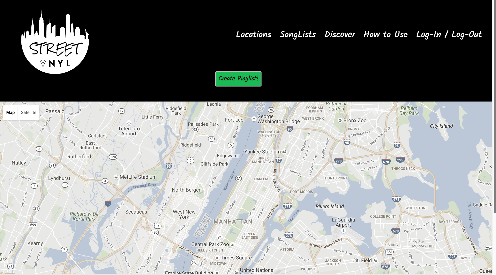
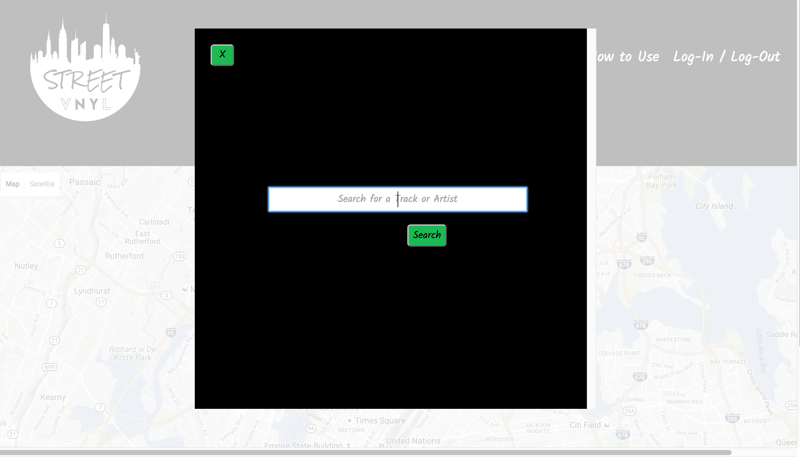
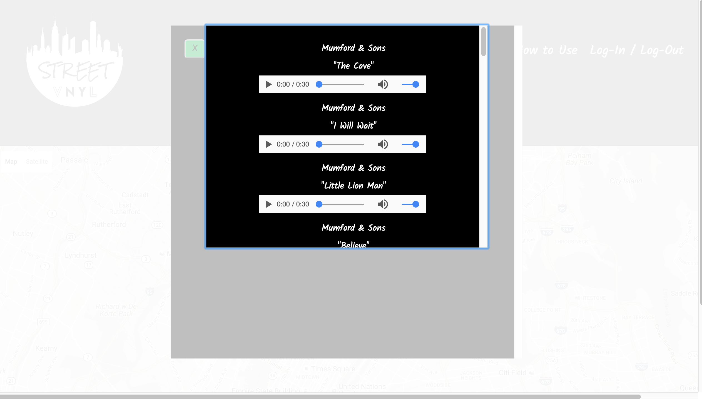

# street-VNYL

### A collaborative project that combines music and geolocation.

An app that allows a user to discover, share, and show off music in all the places you visit in New York (and really, anywhere globally!) - whether places you frequent or areas that are brand new to you, where others are collaborating and creating.  It's a great way to find what others in the area are listening to and share in their joy that is music.  There's no i in VNYL because we feel this is application is meant to be a group effort and not a solo project.  

The intent is that a user is able to register a street-VNYL account and/or log-in if an account already exists, in which case you immediately have the ability to create a playlist from your current location OR add/listen to or view a previously existing playlist in that exact location.  

Still working on:  adding specific tracks to your playlist, breaking down a few of the React components for organizational purposes, having a completely mobile friendly app, some additional styling.  

Tech used:
* HTML5
* CSS
* Javascript 
* ReactJS
* Node.js
* Express
* Google Maps API
* Spotify API

